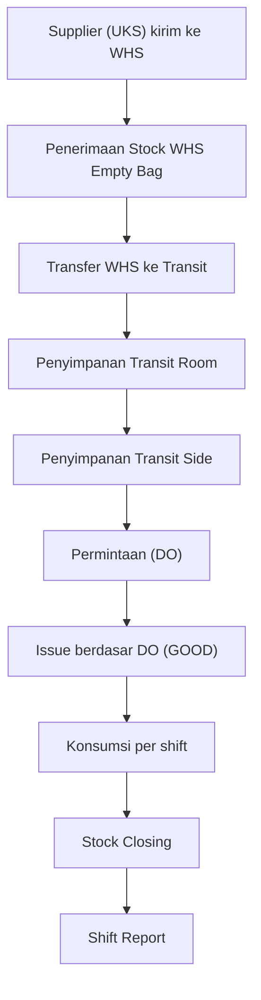
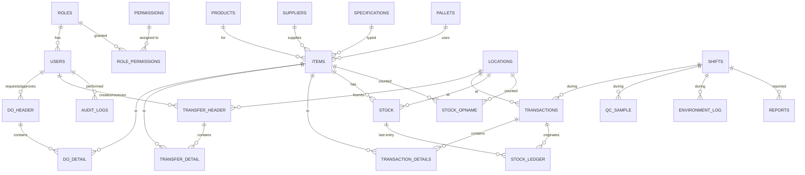
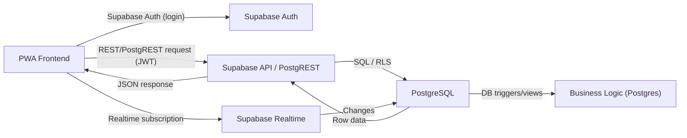

# PRD — Empty Bag Inventory Management System (EmptyBag-IMS)

**Master Blueprint Pengembangan Aplikasi**
Versi: 1.0
Status: Approved for Development
Sifat Dokumen: Single Source of Truth

Dokumen ini adalah satu-satunya acuan utama (single source of truth) untuk pengembangan aplikasi **Empty Bag Inventory Management System (EmptyBag-IMS)**, mencakup seluruh aspek dari requirement, business rule, arsitektur database, arsitektur sistem, requirement UI/UX, requirement API, requirement keamanan, requirement testing, hingga requirement deployment. Dokumen ini digunakan bersama oleh AI coding agent, developer, QA, dan stakeholder bisnis.

---

## Daftar Isi

1. [Product Overview](#1-product-overview)
2. [Business Background & Problem Statement](#2-business-background--problem-statement)
3. [Product Vision & Objective](#3-product-vision--objective)
4. [User Role Definition](#4-user-role-definition)
5. [Operational Business Process](#5-operational-business-process)
6. [Shift Management](#6-shift-management)
7. [Empty Bag Business Master](#7-empty-bag-business-master)
8. [Inventory Management Requirement](#8-inventory-management-requirement)
9. [Consumption Management](#9-consumption-management)
10. [Database Architecture](#10-database-architecture)
11. [Entity Relationship Design](#11-entity-relationship-design)
12. [Application Module Requirement](#12-application-module-requirement)
13. [Frontend PWA Requirement](#13-frontend-pwa-requirement)
14. [Backend Architecture](#14-backend-architecture)
15. [API Requirement](#15-api-requirement)
16. [Dashboard Requirement](#16-dashboard-requirement)
17. [Report Requirement](#17-report-requirement)
18. [Security Requirement](#18-security-requirement)
19. [Performance Requirement](#19-performance-requirement)
20. [Data Migration Plan](#20-data-migration-plan)
21. [Testing Requirement](#21-testing-requirement)
22. [Deployment Requirement](#22-deployment-requirement)
23. [Development Roadmap](#23-development-roadmap)
24. [Acceptance Criteria](#24-acceptance-criteria)
25. [Future Development](#25-future-development)

---

## 1. Product Overview

### 1.1 Nama Aplikasi
**Empty Bag Inventory Management System** (disingkat **EmptyBag-IMS**).

### 1.2 Tujuan
EmptyBag-IMS adalah sistem manajemen inventori khusus untuk **kantong semen kosong (empty bag)** yang digunakan pada proses pengemasan (packing) di pabrik semen. Sistem mengelola seluruh siklus hidup empty bag mulai dari:

- Penerimaan stock awal di Warehouse (WHS) Empty Bag.
- Transfer dari WHS Empty Bag menuju Transit.
- Penyimpanan di Transit Room dan Transit Side.
- Permintaan dan issue empty bag berdasarkan Delivery Order (DO).
- Pencatatan consumption, damage, reject, buffer, lower, dan trial roto.
- Stock closing dan shift report.

### 1.3 Scope
Sistem mencakup:

- Master data empty bag (item, product, supplier, specification, pallet).
- Manajemen multi-lokasi penyimpanan (WHS Empty Bag, Transit Room, Transit Side).
- Manajemen transfer antar lokasi.
- Manajemen DO (Delivery Order) dan issue.
- Pencatatan consumption berbasis shift.
- Monitoring stock real-time.
- Pelaporan (harian, per shift, per item, per PIC).
- Quality Control (QC) sample.
- Monitoring lingkungan penyimpanan.
- Stock opname.
- Audit trail lengkap.

Di luar scope (tidak termasuk dalam rilis pertama):

- Integrasi penuh dengan sistem ERP (direncanakan pada fase future development).
- Aplikasi mobile native (menggunakan PWA sebagai pengganti).
- Prediksi permintaan berbasis AI (direncanakan pada fase future development).

### 1.4 Target Pengguna
| Kelompok | Deskripsi |
|---|---|
| **SI (Superintendent)** | Pengawas level superintendent yang memantau keseluruhan operasi. |
| **Leader** | Pimpinan shift/tim yang mengelola transfer dan aktivitas operasional. |
| **Petugas Transit** | Operator lapangan yang melakukan pencatatan stock, issue, QC, dan environment. |

### 1.5 Platform
- **Web/PWA** (Progressive Web App) yang berjalan di browser pada perangkat mobile, tablet, dan desktop.
- Dapat di-install di perangkat Android/iOS menyerupai aplikasi native (seperti APK).
- Backend menggunakan **Supabase** dan database **PostgreSQL**.
- Authentication menggunakan **Supabase Auth**.

### 1.6 Alasan Pembangunan
- Sistem lama berbasis Google Apps Script + Google Spreadsheet tidak lagi memadai.
- Kebutuhan operasional yang meningkat menuntut sistem yang multi-user, real-time, dan dapat diaudit.
- Kebutuhan akses dari lapangan (field) dengan koneksi tidak stabil.

### 1.7 Nilai Bisnis
| Nilai | Dampak |
|---|---|
| Akurasi stock | Mencegah selisih stock (stock mismatch) antara catatan dan fisik. |
| Efisiensi operasional | Mengurangi waktu input manual dan pekerjaan ganda. |
| Traceability | Setiap pergerakan stock dapat ditelusuri sampai level transaksi. |
| Real-time monitoring | SI dapat memantau kondisi terkini tanpa menunggu laporan. |
| Pengambilan keputusan | Data historis terstruktur mendukung analisis konsumsi dan perencanaan. |
| Auditability | Audit trail lengkap mendukung kepatuhan dan investigasi. |

---

## 2. Business Background & Problem Statement

### 2.1 Kondisi Sistem Lama
Sistem berjalan di atas **Google Apps Script** dan **Google Spreadsheet**, dengan karakteristik:

- Data disimpan dalam bentuk spreadsheet yang dapat diedit langsung oleh banyak orang.
- Input dilakukan secara manual oleh petugas.
- Tidak ada mekanisme validasi antar transaksi yang terstruktur.
- Tidak ada pemisahan hak akses (siapa pun dapat mengubah data).
- Tidak ada audit trail otomatis.

### 2.2 Kendala Penggunaan Spreadsheet
| Kendala | Deskripsi |
|---|---|
| Multi-user conflict | Dua pengguna mengedit sel yang sama dapat menyebabkan data tertimpa. |
| Tidak ada constraint | Tidak ada primary key, foreign key, atau validasi data di tingkat database. |
| Selisih data | Formula copy-paste sering menyebabkan kesalahan hitung. |
| Keterbatasan skala | Ribuan baris transaksi membuat spreadsheet lambat. |
| Koneksi tidak stabil | Perubahan data tidak tersimpan jika koneksi terputus saat edit. |
| Tidak real-time | Dashboard manual harus di-refresh, data bisa basi. |
| Tidak ada audit | Tidak diketahui siapa, kapan, dan apa yang mengubah data. |
| Struktur data lemah | Tidak ada standarisasi istilah (misal: SMP vs MP) antar sheet. |

### 2.3 Kebutuhan Digitalisasi
- Data tersentralisasi dalam satu database yang konsisten.
- Setiap perubahan stock tercatat sebagai transaksi (ledger).
- Pemisahan role dan permission yang jelas.
- Proses bisnis (transfer, DO, issue, closing) mengalir sesuai workflow.
- Interface yang cepat dan mudah digunakan oleh operator lapangan.

### 2.4 Kebutuhan Real-Time Monitoring
- SI (Superintendent) perlu memantau stock, consumption, dan pergerakan tanpa menunggu laporan harian.
- Leader perlu melihat status transfer dan aktivitas operasional secara langsung.
- Sistem harus mampu menampilkan kondisi stock terkini dalam hitungan detik setelah transaksi.

### 2.5 Kebutuhan Audit Trail
- Setiap aksi (create, update, delete, approval) harus tercatat.
- Audit harus mencakup: siapa (user), kapan (timestamp), apa (aksi), objek (record), sebelum (old value), sesudah (new value), dan dari mana (source/device).
- Audit trail wajib bersifat append-only (tidak dapat diubah atau dihapus).

### 2.6 Alasan Migrasi ke PWA + Supabase PostgreSQL
| Faktor | Sistem Lama (Spreadsheet) | Sistem Baru (PWA + Supabase) |
|---|---|---|
| Arsitektur | File spreadsheet | Database PostgreSQL terkelola |
| Real-time | Tidak | Ya (Supabase Realtime) |
| Multi-user | Konflik edit | Concurrent-safe (transaksi DB) |
| Keamanan | Open access | Supabase Auth + Row Level Security |
| Offline-friendly | Tidak | PWA dengan caching |
| Skalabilitas | Terbatas | Horizontal scalable |
| Auditing | Tidak ada | Audit log terstruktur |
| Mobile | Buruk | Mobile-first PWA |

---

## 3. Product Vision & Objective

### 3.1 Visi
Menjadi sistem inventory management khusus empty bag yang **akurat, real-time, dan dapat dipercaya**, mampu melakukan monitoring stock, consumption, transfer, reporting, dan traceability secara end-to-end — dari gudang pusat hingga titik pemakaian di lantai produksi.

### 3.2 Misi
- Menyediakan data stock yang selalu akurat dan konsisten di semua lokasi.
- Menggantikan seluruh proses manual spreadsheet dengan workflow digital yang terstruktur.
- Memberikan visibilitas penuh kepada SI, Leader, dan Petugas Transit terhadap kondisi operasional.
- Menjamin setiap transaksi dapat ditelusuri (traceable) dan diaudit.

### 3.3 Objective (Terukur)
| Kode | Objective | Ukuran Keberhasilan |
|---|---|---|
| OBJ-1 | Akurasi stock | Selisih stock fisik vs sistem <= 0,1% setelah opname. |
| OBJ-2 | Waktu input transaksi | Rata-rata pencatatan transaksi < 60 detik. |
| OBJ-3 | Real-time visibility | Data terlihat di dashboard < 5 detik setelah transaksi. |
| OBJ-4 | Eliminasi spreadsheet | 100% pencatatan operasional masuk ke sistem, tanpa dual entry. |
| OBJ-5 | Auditability | 100% perubahan data terekam di audit log. |
| OBJ-6 | Availability | Uptime >= 99,5% pada jam operasional. |

### 3.4 Capability Inti
1. **Stock Monitoring** — pantau stock di WHS, Transit Room, Transit Side secara real-time.
2. **Consumption Tracking** — catat pemakaian per kategori per shift.
3. **Transfer Management** — kelola transfer antar lokasi dengan dokumen transfer.
4. **DO Management** — kelola permintaan dan issue berdasarkan DO.
5. **Reporting** — laporan pemakaian, stock, dan aktivitas per shift/hari/PIC.
6. **Traceability** — telusuri pergerakan tiap lot empty bag.

---

## 4. User Role Definition

Sistem menerapkan **Role Based Access Control (RBAC)** dengan tiga role utama.

### 4.1 SI (Superintendent)

| Aspek | Deskripsi |
|---|---|
| Tanggung jawab | Memantau keseluruhan operasional inventori empty bag, memastikan ketersediaan stock, menganalisis konsumsi, menyetujui kebijakan stock, dan menindaklanjuti anomali. |
| Akses menu | Dashboard SI, Stock Monitoring, Consumption, Transfer (read), DO Management (read), Report, QC Sample (read), Environment Monitoring (read), Stock Opname (approve), Master Management (read), Audit Log. |
| Permission | Create: - / Read: Semua data | Update: data master (jika diberi hak), koreksi transaksi (dengan approval flow) | Approval: stock opname, penyesuaian (adjustment), koreksi transaksi. |
| Batasan | Tidak melakukan input transaksi harian. Tidak dapat menghapus transaksi (hanya dapat menandai void). |

### 4.2 Leader

| Aspek | Deskripsi |
|---|---|
| Tanggung jawab | Memimpin tim shift, mengelola transfer dari WHS ke Transit, memastikan aktivitas operasional berjalan, memverifikasi data yang diinput petugas, dan menyusun laporan shift. |
| Akses menu | Dashboard Leader, Transfer (create/approve), Stock Monitoring, DO Management (create issue), Consumption (approve), Report (create), Environment Monitoring (view). |
| Permission | Create: transfer, DO, issue | Read: seluruh data operasional | Update: data yang menjadi tanggung jawabnya sebelum approval | Approval: issue tambahan (additional issue), hasil input petugas. |
| Batasan | Tidak dapat mengubah transaksi yang sudah diapprove/closed tanpa approval SI. |

### 4.3 Petugas Transit

| Aspek | Deskripsi |
|---|---|
| Tanggung jawab | Melakukan pencatatan stock harian, input konsumsi, pencatatan issue, input QC sample, pencatatan environment, dan pembuatan shift report. |
| Akses menu | Dashboard Petugas Transit, Quick Input, Current Stock, Stock Monitoring (view), Transfer (input penerimaan), Consumption (input), DO (input), QC Sample (input), Environment Monitoring (input), Shift Report. |
| Permission | Create: transaksi harian (konsumsi, issue, QC, environment) | Read: data lokasi sendiri | Update: draft sebelum disubmit | Approval: tidak memiliki hak approval. |
| Batasan | Hanya dapat mengakses dan melihat data lokasi Transit yang menjadi tanggung jawabnya. Tidak dapat mengakses master data dan audit log. |

### 4.4 Matriks Permission

| Aksi | SI | Leader | Petugas Transit |
|---|---|---|---|
| Create Transaksi | - | Transfer, DO, Issue | Konsumsi, Issue, QC, Environment |
| Create Master Data | Ya (jika ditunjuk) | - | - |
| Read Semua Data | Ya | Ya (operasional) | Lokasi sendiri |
| Update Sebelum Approve | - | Ya | Ya (draft) |
| Approve Transfer | Ya | Ya | - |
| Approve Issue | - | Ya | - |
| Approve Opname / Adjustment | Ya | - | - |
| Void / Hapus Transaksi | Ya (void) | - | - |
| Akses Audit Log | Ya | - | - |
| Akses Master Management | Read | - | - |

### 4.5 Aturan Umum Role
- Satu user memiliki tepat satu role (pada rilis pertama).
- Setiap user terikat pada satu atau lebih lokasi (default: lokasi tugas).
- Semua transaksi wajib mencantumkan user yang melakukan (PIC) dan shift aktif.

---

## 5. Operational Business Process

Dokumentasi berikut adalah alur operasional baku (business process). Setiap alur menghasilkan dokumen transaksi yang tercatat di database dan mempengaruhi stock ledger.

### 5.1 Stock Awal WHS Empty Bag
1. Empty bag datang dari supplier/vendor (contoh: UKS) ke Warehouse (WHS) Empty Bag.
2. Petugas WHS menerima fisik berdasarkan dokumen pengiriman, melakukan pengecekan jumlah, jenis, dan spesifikasi.
3. Penerimaan dicatat sebagai **Stock Opening / Stock In** di lokasi WHS Empty Bag.
4. Stock WHS Empty Bag bertambah melalui Stock Ledger (Transfer In / Opening).
5. Minimal data: item, qty, pallet, supplier, tanggal, nomor dokumen, PIC.

### 5.2 Transfer dari WHS Empty Bag ke Transit
1. Leader membuat dokumen **Transfer** dari WHS Empty Bag menuju lokasi Transit (Room/Side).
2. Dokumen transfer berisi: item, qty, nomor pallet, tanggal, shift, kendaraan/petugas.
3. Setelah fisik dikirim dan diterima di Transit, Petugas Transit mengonfirmasi penerimaan.
4. Sistem mencatat: **Transfer Out** di WHS Empty Bag (stock berkurang) dan **Transfer In** di Transit (stock bertambah).
5. Transfer dianggap selesai setelah konfirmasi penerimaan oleh Petugas Transit dan approval Leader.

### 5.3 Penyimpanan Transit Side
1. Empty bag yang diterima di Transit dapat ditempatkan di **Transit Side** (area penyimpanan dekat titik packing).
2. Pemindahan dari Transit Room ke Transit Side dicatat sebagai transfer internal lokasi (masih dalam lingkup Transit).
3. Stock di Transit Side dipantau untuk memastikan ketersediaan sebelum dan selama produksi.

### 5.4 Penyimpanan Transit Room
1. Empty bag yang belum digunakan disimpan di **Transit Room**.
2. Transit Room berfungsi sebagai buffer penyimpanan utama di area transit.
3. Pemindahan Transit Room <-> Transit Side wajib dicatat agar stock kedua lokasi akurat.

### 5.5 Permintaan Empty Bag
1. Kebutuhan empty bag untuk produksi diajukan melalui **DO (Delivery Order)**.
2. DO berisi: item empty bag, qty yang diminta, tanggal, shift, pemohon.
3. DO harus disetujui (approve) oleh Leader sebelum dapat di-issue.
4. DO yang belum diapprove tidak boleh mempengaruhi stock.

### 5.6 Issue Berdasarkan DO
1. Setelah DO disetujui, dilakukan **Issue** sejumlah qty sesuai DO.
2. Issue mengurangi stock di lokasi sumber (Transit Room/Side) melalui Stock Ledger.
3. Kategori default issue adalah **GOOD** (issue utama).
4. Issue mencatat: item, qty, DO reference, lokasi, shift, PIC, timestamp.

### 5.7 Additional Issue
1. Jika terjadi kondisi khusus (damage, reject, buffer, lower, trial), dilakukan **Additional Issue** di luar qty DO.
2. Additional issue harus mendapatkan **approval Leader**.
3. Kategori additional issue mengikuti kategori pada Section 9 (DAMAGE, REJECT, BUFFER, LOWER, TRIAL ROTO, OTHER).
4. Additional issue mencatat alasan (reason) dan referensi dokumen pendukung.
5. Total yang keluar dari stock = qty DO (GOOD) + seluruh additional issue.

### 5.8 Consumption
1. Konsumsi dicatat berdasarkan pemakaian empty bag pada proses packing.
2. Pencatatan dilakukan per shift oleh Petugas Transit.
3. Konsumsi mencakup jumlah yang benar-benar terpakai (issued) per kategori.
4. **LOWER**: jumlah empty bag PCS pengganti yang benar-benar di-issued akibat kondisi lower/over — bukan hasil konversi tonase.
5. Konsumsi tercatat sebagai transaksi dan menurunkan stock available.

### 5.9 Stock Closing
1. Pada akhir shift, dilakukan **Stock Closing** untuk lokasi Transit (Room dan Side).
2. Petugas Transit melakukan perhitungan fisik dan mencocokkan dengan saldo sistem.
3. Rumus verifikasi: **Opening Stock + Transfer In - Transfer Out - Issued + Adjustment = Saldo Sistem**.
4. Jika ditemukan selisih, dibuat **adjustment** (dengan approval SI) dan dicatat di audit.
5. Setelah closing, shift berakhir dan saldo menjadi opening stock shift berikutnya.

### 5.10 Shift Report
1. Setelah stock closing, Petugas Transit membuat **Shift Report**.
2. Shift report dirangkum per shift dan mencakup seluruh aktivitas (issue, konsumsi, transfer, QC, environment).
3. Report diverifikasi oleh Leader dan tersedia untuk SI.
4. Format laporan mengacu pada Section 17.

### 5.11 Diagram Alur Ringkas



---

## 6. Shift Management

### 6.1 Definisi Shift Reguler
| Shift | Rentang Waktu | Keterangan |
|---|---|---|
| Shift 1 | 00:01 - 08:00 | Dini hari |
| Shift 2 | 08:01 - 16:00 | Pagi |
| Shift 3 | 16:01 - 00:00 | Sore/malam |

### 6.2 Definisi Long Shift
| Long Shift | Rentang Waktu | Keterangan |
|---|---|---|
| AM | 08:01 - 20:00 | Siang panjang |
| PM | 20:01 - 08:00 | Malam panjang (melewati tengah malam) |

### 6.3 Aturan Shift
1. Setiap transaksi diwajibkan merekam **shift aktif** saat transaksi terjadi.
2. Pergantian shift dihitung otomatis dari timestamp transaksi berdasarkan tabel di atas.
3. Sistem menyediakan fallback **manual shift selection** untuk kasus transaksi yang dicatat terlambat atau backdate.

### 6.4 Handling Pergantian Tanggal pada Long Shift PM
Aturan khusus berlaku untuk **Long Shift PM (20:01 - 08:00)** yang melewati pergantian tanggal (midnight):

| Aturan | Deskripsi |
|---|---|
| Binding tanggal | Tanggal shift Long Shift PM mengacu pada **tanggal awal shift** (hari saat shift dimulai pukul 20:01). |
| Contoh | Shift PM mulai Selasa 20:01 sampai Rabu 08:00 → tercatat sebagai shift tanggal **Selasa**. |
| Transaksi 00:01 - 08:00 | Transaksi pada Rabu 00:01 - 08:00 tetap masuk ke shift Long Shift PM **tanggal Selasa**, bukan Shift 1. |
| Shift Report | Laporan Long Shift PM menggunakan tanggal awal shift sebagai tanggal pelaporan. |
| Stock Closing | Closing Long Shift PM dilakukan setelah pukul 08:00 hari berikutnya; saldo penutup menjadi opening untuk shift berikutnya. |
| Tampilan | Sistem menampilkan label tanggal shift dan tanggal transaksi secara terpisah agar tidak ambigu. |

### 6.5 Aturan Pergantian Shift Reguler
| Dari | Ke | Pukul | Tanggal |
|---|---|---|---|
| Shift 3 (hari sebelumnya) | Shift 1 | 00:01 | Tanggal bertambah |
| Shift 1 | Shift 2 | 08:01 | Tanggal sama |
| Shift 2 | Shift 3 | 16:01 | Tanggal sama |

### 6.6 Struktur Data Shift
| Field | Deskripsi |
|---|---|
| shift_code | Kode shift: `S1`, `S2`, `S3`, `AM`, `PM` |
| shift_name | Nama shift: Shift 1, Shift 2, Shift 3, Long Shift AM, Long Shift PM |
| start_time | Jam mulai (HH:mm) |
| end_time | Jam selesai (HH:mm) |
| crosses_midnight | Boolean: apakah shift melewati tengah malam (true untuk Long Shift PM) |
| is_active | Status aktif shift |

---

## 7. Empty Bag Business Master

### 7.1 Struktur Master Item Empty Bag
Master item adalah data utama empty bag. **Item Code** adalah identifier utama (unik).

| Field | Tipe | Wajib | Deskripsi |
|---|---|---|---|
| item_code | String (unik) | Ya | Identifier utama empty bag. |
| item_name | String | Ya | Nama lengkap empty bag. |
| item_type | Enum | Ya | Jenis empty bag (lihat 7.2). |
| weight | Numeric | Ya | Berat per kantong (gram/PCS). |
| material | String | Ya | Material kantong (misal: Woven PP, Kraft). |
| product_id | FK -> products | Ya | Produk semen yang menggunakan empty bag ini. |
| supplier_id | FK -> suppliers | Ya | Supplier/vendor penyedia empty bag. |
| specification_id | FK -> specifications | Ya | Spesifikasi/type empty bag. |
| unit | Enum | Ya | Satuan: `PCS`, `PACK`, `PALLET`. |
| pallet_id | FK -> pallets | Ya | Tipe pallet default. |
| qty_per_pallet | Numeric | Ya | Jumlah kantong per pallet. |
| min_stock | Numeric | Ya | Minimum stock yang harus dijaga. |
| reorder_point | Numeric | Ya | Titik pemicu pemesanan/pengisian ulang. |
| target_stock | Numeric | Ya | Level stock target yang diinginkan. |
| is_active | Boolean | Ya | Status aktif. |
| remarks | Text | Tidak | Catatan tambahan. |

### 7.2 Jenis Empty Bag
Jenis empty bag adalah klasifikasi yang digunakan untuk membedakan penggunaan dan spesifikasi.

### 7.3 Business Rule Master

| Aturan | Penjelasan |
|---|---|
| SMP = MP | **SMP** dan **MP** mengacu pada produk yang sama. Sistem wajib memperlakukan keduanya sebagai satu entitas yang sama (normalisasi ke satu record item). |
| SMP berarti Semen Merah Putih | **SMP** adalah akronim dari **Semen Merah Putih**. |
| SPK menggunakan Patriot | **SPK** adalah produk semen yang menggunakan empty bag bermerek **Patriot**. |
| UKS adalah supplier | **UKS** adalah **supplier/vendor** penyedia empty bag. |
| AP85 dan AP65 adalah specification | **AP85** dan **AP65** adalah **specification/type** dari supplier UKS. |

### 7.4 Penerapan Rule pada Struktur Master
- **products**: berisi produk semen, termasuk `SMP` (Semen Merah Putih), `MP` (diarahkan ke record yang sama dengan SMP), `SPK` (menggunakan empty bag Patriot).
- **suppliers**: berisi data supplier, termasuk `UKS`.
- **specifications**: berisi type/specification, termasuk `AP85` dan `AP65`.
- **items**: setiap item empty bag mereferensikan product, supplier, dan specification yang sesuai.

### 7.5 Contoh Pemetaan (Ilustratif)
| Item Code | Item Name | Jenis | Product | Supplier | Spec | Berat |
|---|---|---|---|---|---|---|
| EB-0001 | Woven PP 50kg Patriot | Semen | SPK | UKS | AP85 | 70 g |
| EB-0002 | Woven PP 50kg SMP | Semen | SMP (Semen Merah Putih) | UKS | AP65 | 70 g |

> Catatan: Data ilustratif di atas hanyalah contoh; data aktual mengikuti konfigurasi master di lokasi produksi.

### 7.6 Aturan Konfigurasi Master
- Item Code tidak boleh diubah setelah item digunakan dalam transaksi (immutable).
- Penambahan/penonaktifan master hanya boleh dilakukan oleh user berhak (SI).
- Setiap perubahan master tercatat di audit log.

---

## 8. Inventory Management Requirement

### 8.1 Konsep Lokasi Penyimpanan (Location)
| Lokasi | Kode | Deskripsi |
|---|---|---|
| WHS Empty Bag | WHS | Warehouse pusat penyimpanan empty bag. |
| Transit Room | TROOM | Ruang penyimpanan di area transit. |
| Transit Side | TSIDE | Area penyimpanan samping (dekat titik packing). |

### 8.2 Prinsip Stock
| Aturan | Penjelasan |
|---|---|
| Semua perubahan stock wajib melalui Stock Ledger | Setiap penambahan/pengurangan stock harus berupa entri ledger. |
| Tidak boleh update stock secara langsung | Dilarang mengubah angka stock langsung pada tabel stock; perubahan hanya melalui transaksi yang menghasilkan entri ledger. |
| Single source of truth | Tabel `stock` adalah representasi saldo terkini; nilai saldo dihitung/dipelihara dari Stock Ledger. |

### 8.3 Formula Dasar Stock
```
Stock Saat Ini = Opening Stock
               + Transfer In
               - Transfer Out
               - Issued
               + Adjustment
```

### 8.4 Jenis Mutasi Stock
| Tipe | Pengaruh | Sumber Transaksi |
|---|---|---|
| Opening | + | Penerimaan awal / stock awal |
| Transfer In | + | Penerimaan transfer antar lokasi |
| Transfer Out | - | Pengiriman transfer keluar lokasi |
| Issued | - | Issue berdasar DO + additional issue |
| Adjustment | +/- | Penyesuaian hasil opname/koreksi (dengan approval) |

### 8.5 Aturan Konsistensi Stock
1. Setiap entri Stock Ledger mereferensikan satu transaksi asal (source transaction).
2. Saldo di tabel `stock` di-update secara atomik dalam transaksi database yang sama dengan entri ledger (guaranteed consistency).
3. Jumlah stock di suatu lokasi tidak boleh negatif (soft check; dihindari dengan validasi sebelum issue).
4. Rekonsiliasi otomatis: sistem dapat menghitung ulang saldo dari ledger kapan saja (recompute) untuk deteksi anomali.
5. Perbedaan lokasi diperlakukan sebagai posisi stock yang terpisah.

### 8.6 Multi-Lokasi
- Stock dipantau per **lokasi** dan per **item**.
- Dashboard menampilkan saldo per lokasi (WHS, Transit Room, Transit Side).
- Transfer antar lokasi selalu menghasilkan mutasi berpasangan (out di lokasi sumber, in di lokasi tujuan) dalam satu dokumen.

---

## 9. Consumption Management

### 9.1 Kategori Konsumsi
| Kode | Nama | Deskripsi |
|---|---|---|
| GOOD | Good | **Issue utama berdasarkan DO.** Jumlah empty bag yang sesuai permintaan DO. |
| DAMAGE | Damage | **Tambahan empty bag akibat kerusakan saat loading** (bag sobek/rusak selama pemuatan). |
| REJECT | Reject | **Tambahan akibat reject** (kantong ditolak/tidak lolos kualitas saat dipakai). |
| BUFFER | Buffer | **Tambahan kebutuhan operasional** di luar DO. |
| LOWER | Lower | **Jumlah empty bag PCS pengganti yang benar-benar di-issued akibat kondisi lower/over** — bukan hasil konversi tonase. |
| TRIAL ROTO | Trial Roto | **Kebutuhan trial** (uji coba mesin/roto). |
| OTHER | Other | Kategori lain yang disetujui. |

### 9.2 Business Rule Kategori
| Aturan | Penjelasan |
|---|---|
| GOOD = issue utama | GOOD hanya berasal dari DO yang telah disetujui. |
| DAMAGE = tambahan | DAMAGE dicatat sebagai additional issue dengan alasan kerusakan loading. |
| REJECT = tambahan | REJECT dicatat sebagai additional issue dengan alasan reject. |
| BUFFER = tambahan | BUFFER dicatat sebagai additional issue untuk kebutuhan operasional. |
| LOWER ≠ konversi tonase | LOWER adalah **jumlah PCS yang benar-benar di-issued** sebagai pengganti, **bukan** hasil perhitungan konversi dari tonase. |
| TRIAL ROTO | TRIAL ROTO dicatat sebagai additional issue khusus kebutuhan trial. |
| Kantong kosong (bekas) | Kantong kosong bekas pakai **bukan** stock available dan tidak boleh masuk perhitungan stock. |

### 9.3 Perhitungan Total Issued
```
Total Issued = GOOD + DAMAGE + REJECT + BUFFER + LOWER + TRIAL ROTO + OTHER
```

### 9.4 Workflow Pencatatan Konsumsi
1. Petugas Transit mencatat issue per kategori pada shift berjalan.
2. GOOD mengacu pada DO aktif.
3. Kategori tambahan (DAMAGE, REJECT, BUFFER, LOWER, TRIAL ROTO, OTHER) memerlukan alasan dan (jika memungkinkan) referensi dokumen.
4. Data di-verifikasi Leader.
5. Setiap kategori mengurangi stock melalui Stock Ledger (issued).

---

## 10. Database Architecture

### 10.1 Platform Database
- **PostgreSQL** yang dikelola oleh **Supabase**.
- Konvensi penamaan: `snake_case`.
- Primary key: kolom `id` (UUID) kecuali dinyatakan lain.
- Setiap tabel memiliki `created_at` dan `updated_at` (timestamptz).
- Soft delete digunakan untuk data master (`is_active = false`), bukan hard delete.
- Row Level Security (RLS) diaktifkan pada semua tabel (detail di Section 18).

### 10.2 Daftar Tabel

#### 1. users
**Tujuan:** Menyimpan profil pengguna aplikasi (terhubung dengan Supabase Auth).
| Field | Tipe | Ket |
|---|---|---|
| id | UUID (PK) | Sinkron dengan `auth.users`. |
| role_id | FK -> roles | Role pengguna. |
| full_name | String | Nama lengkap / PIC. |
| employee_id | String | NIP / nomor pegawai. |
| location_ids | Array<UUID> | Lokasi yang menjadi tanggung jawab. |
| phone | String | Nomor kontak (opsional). |
| is_active | Boolean | Status aktif. |

#### 2. roles
**Tujuan:** Master role pengguna.
| Field | Tipe | Ket |
|---|---|---|
| id | UUID (PK) | - |
| code | String (unik) | `SI`, `LEADER`, `PETUGAS_TRANSIT`. |
| name | String | Nama role. |
| description | Text | Deskripsi. |

#### 3. permissions
**Tujuan:** Master izin (create/read/update/approve) per modul.
| Field | Tipe | Ket |
|---|---|---|
| id | UUID (PK) | - |
| module | String | Nama modul (dashboard, stock, transfer, dll). |
| action | String | `create`, `read`, `update`, `delete`, `approve`. |
| description | Text | Deskripsi. |

#### 4. role_permissions
**Tujuan:** Mapping role ke permission (many-to-many).
| Field | Tipe | Ket |
|---|---|---|
| id | UUID (PK) | - |
| role_id | FK -> roles | - |
| permission_id | FK -> permissions | - |

#### 5. items
**Tujuan:** Master item empty bag (lihat Section 7).
| Field | Tipe | Ket |
|---|---|---|
| id | UUID (PK) | - |
| item_code | String (unik) | Identifier utama. |
| item_name | String | - |
| item_type | Enum | Jenis empty bag. |
| weight | Numeric | gram/PCS. |
| material | String | - |
| product_id | FK -> products | - |
| supplier_id | FK -> suppliers | - |
| specification_id | FK -> specifications | - |
| unit | Enum | PCS/PACK/PALLET. |
| pallet_id | FK -> pallets | - |
| qty_per_pallet | Numeric | - |
| min_stock | Numeric | - |
| reorder_point | Numeric | - |
| target_stock | Numeric | - |
| is_active | Boolean | - |

#### 6. products
**Tujuan:** Master produk semen (SMP/Semen Merah Putih, MP, SPK, dll).
| Field | Tipe | Ket |
|---|---|---|
| id | UUID (PK) | - |
| product_code | String (unik) | `SMP`, `MP`, `SPK`, dll. |
| product_name | String | Nama produk. |
| is_active | Boolean | - |

> Catatan: Sesuai business rule, SMP dan MP adalah produk yang sama; sistem memastikan hanya satu record aktif untuk keduanya (aliasing `product_code`).

#### 7. suppliers
**Tujuan:** Master supplier/vendor (contoh: UKS).
| Field | Tipe | Ket |
|---|---|---|
| id | UUID (PK) | - |
| supplier_code | String (unik) | `UKS`, dll. |
| supplier_name | String | Nama vendor. |
| contact | String | Kontak. |
| is_active | Boolean | - |

#### 8. specifications
**Tujuan:** Master specification/type empty bag (contoh: AP85, AP65).
| Field | Tipe | Ket |
|---|---|---|
| id | UUID (PK) | - |
| spec_code | String (unik) | `AP85`, `AP65`. |
| spec_name | String | Nama specification. |
| description | Text | - |
| is_active | Boolean | - |

#### 9. pallets
**Tujuan:** Master pallet.
| Field | Tipe | Ket |
|---|---|---|
| id | UUID (PK) | - |
| pallet_code | String (unik) | Kode pallet. |
| description | String | - |
| capacity | Numeric | Kapasitas pallet. |
| is_active | Boolean | - |

#### 10. locations
**Tujuan:** Master lokasi penyimpanan.
| Field | Tipe | Ket |
|---|---|---|
| id | UUID (PK) | - |
| location_code | String (unik) | `WHS`, `TROOM`, `TSIDE`. |
| location_name | String | WHS Empty Bag, Transit Room, Transit Side. |
| location_type | Enum | WAREHOUSE / TRANSIT. |
| is_active | Boolean | - |

#### 11. shifts
**Tujuan:** Master shift (lihat Section 6).
| Field | Tipe | Ket |
|---|---|---|
| id | UUID (PK) | - |
| shift_code | String (unik) | `S1`, `S2`, `S3`, `AM`, `PM`. |
| shift_name | String | - |
| start_time | Time | - |
| end_time | Time | - |
| crosses_midnight | Boolean | - |
| is_active | Boolean | - |

#### 12. do_header
**Tujuan:** Header dokumen Delivery Order (permintaan empty bag).
| Field | Tipe | Ket |
|---|---|---|
| id | UUID (PK) | - |
| do_number | String (unik) | Nomor DO. |
| do_date | Date | Tanggal DO. |
| shift_id | FK -> shifts | Shift. |
| requested_by | FK -> users | Pemohon. |
| approved_by | FK -> users | Approver (Leader). |
| status | Enum | `DRAFT`, `SUBMITTED`, `APPROVED`, `REJECTED`, `CLOSED`, `VOID`. |
| notes | Text | Catatan. |
| approved_at | Timestamptz | Waktu approval. |

#### 13. do_detail
**Tujuan:** Detail item pada DO.
| Field | Tipe | Ket |
|---|---|---|
| id | UUID (PK) | - |
| do_id | FK -> do_header | Header DO. |
| item_id | FK -> items | Item empty bag. |
| requested_qty | Numeric | Qty diminta. |
| issued_qty | Numeric | Qty ter-issue. |

#### 14. transfer_header
**Tujuan:** Header dokumen transfer antar lokasi.
| Field | Tipe | Ket |
|---|---|---|
| id | UUID (PK) | - |
| transfer_number | String (unik) | Nomor transfer. |
| transfer_date | Date | Tanggal. |
| shift_id | FK -> shifts | Shift. |
| from_location_id | FK -> locations | Lokasi asal (WHS). |
| to_location_id | FK -> locations | Lokasi tujuan (Transit). |
| created_by | FK -> users | Pembuat (Leader). |
| received_by | FK -> users | Penerima (Petugas Transit). |
| status | Enum | `DRAFT`, `IN_TRANSIT`, `RECEIVED`, `COMPLETED`, `VOID`. |
| notes | Text | - |

#### 15. transfer_detail
**Tujuan:** Detail item pada transfer.
| Field | Tipe | Ket |
|---|---|---|
| id | UUID (PK) | - |
| transfer_id | FK -> transfer_header | Header transfer. |
| item_id | FK -> items | Item. |
| qty | Numeric | Jumlah. |
| pallet_code | String | Nomor pallet (opsional). |

#### 16. transactions
**Tujuan:** Header transaksi stock (issue, consumption, adjustment, opening).
| Field | Tipe | Ket |
|---|---|---|
| id | UUID (PK) | - |
| transaction_number | String (unik) | Nomor transaksi. |
| transaction_type | Enum | `OPENING`, `TRANSFER_IN`, `TRANSFER_OUT`, `ISSUE`, `ADJUSTMENT`, `RETURN`. |
| transaction_date | Date | Tanggal. |
| shift_id | FK -> shifts | Shift aktif. |
| location_id | FK -> locations | Lokasi transaksi. |
| reference_type | String | Referensi (DO, transfer, opname). |
| reference_id | UUID | ID dokumen referensi. |
| created_by | FK -> users | PIC. |
| approved_by | FK -> users | Approver. |
| status | Enum | `DRAFT`, `SUBMITTED`, `APPROVED`, `VOID`. |
| notes | Text | Alasan/catatan. |

#### 17. transaction_details
**Tujuan:** Detail transaksi per item.
| Field | Tipe | Ket |
|---|---|---|
| id | UUID (PK) | - |
| transaction_id | FK -> transactions | Header transaksi. |
| item_id | FK -> items | Item. |
| qty | Numeric | Jumlah (+/-). |
| category | Enum | `GOOD`, `DAMAGE`, `REJECT`, `BUFFER`, `LOWER`, `TRIAL_ROTO`, `OTHER` (untuk issue). |
| reason | Text | Alasan (wajib untuk kategori tambahan). |

#### 18. stock
**Tujuan:** Saldo stock terkini per item per lokasi.
| Field | Tipe | Ket |
|---|---|---|
| id | UUID (PK) | - |
| item_id | FK -> items | Item. |
| location_id | FK -> locations | Lokasi. |
| qty | Numeric | Saldo terkini. |
| last_ledger_id | FK -> stock_ledger | Ledger terakhir (traceability). |
| updated_at | Timestamptz | Waktu update terakhir. |
| Unique | (item_id, location_id) | Satu saldo per item per lokasi. |

#### 19. stock_ledger
**Tujuan:** Buku besar mutasi stock (append-only). Semua perubahan stock wajib masuk tabel ini.
| Field | Tipe | Ket |
|---|---|---|
| id | UUID (PK) | - |
| ledger_date | Date | Tanggal ledger. |
| shift_id | FK -> shifts | Shift. |
| item_id | FK -> items | Item. |
| location_id | FK -> locations | Lokasi. |
| transaction_id | FK -> transactions | Transaksi asal. |
| transaction_type | Enum | Jenis mutasi. |
| movement_type | Enum | `IN`, `OUT`. |
| category | Enum | Kategori (untuk issue). |
| qty | Numeric | Jumlah mutasi (+/-). |
| balance_after | Numeric | Saldo setelah mutasi (posting balance). |
| created_by | FK -> users | User pencatat. |
| created_at | Timestamptz | Waktu. |

#### 20. stock_opname
**Tujuan:** Pencatatan stock opname / perhitungan fisik.
| Field | Tipe | Ket |
|---|---|---|
| id | UUID (PK) | - |
| opname_number | String (unik) | Nomor opname. |
| opname_date | Date | Tanggal. |
| location_id | FK -> locations | Lokasi. |
| item_id | FK -> items | Item. |
| system_qty | Numeric | Saldo sistem. |
| physical_qty | Numeric | Saldo fisik. |
| difference | Numeric | Selisih (physical - system). |
| status | Enum | `DRAFT`, `SUBMITTED`, `APPROVED`, `ADJUSTED`, `VOID`. |
| adjusted_by | FK -> users | Approver adjustment (SI). |
| notes | Text | - |

#### 21. qc_sample
**Tujuan:** Pencatatan QC sample empty bag.
| Field | Tipe | Ket |
|---|---|---|
| id | UUID (PK) | - |
| qc_date | Date | Tanggal. |
| shift_id | FK -> shifts | Shift. |
| item_id | FK -> items | Item. |
| sample_qty | Numeric | Jumlah sample. |
| result | Enum | `PASS`, `REJECT`. |
| parameter | JSONB | Parameter QC (berat, ukuran, dll). |
| checked_by | FK -> users | Petugas. |
| notes | Text | - |

#### 22. environment_log
**Tujuan:** Pencatatan kondisi lingkungan penyimpanan (temperature/humidity).
| Field | Tipe | Ket |
|---|---|---|
| id | UUID (PK) | - |
| log_date | Date | Tanggal. |
| shift_id | FK -> shifts | Shift. |
| location_id | FK -> locations | Lokasi. |
| temperature | Numeric | Suhu. |
| humidity | Numeric | Kelembapan. |
| remarks | Text | - |
| recorded_by | FK -> users | Pencatat. |

#### 23. reports
**Tujuan:** Metadata laporan yang dihasilkan (snapshot/export).
| Field | Tipe | Ket |
|---|---|---|
| id | UUID (PK) | - |
| report_type | Enum | `SHIFT_REPORT`, `CONSUMPTION`, `STOCK`, `DO`, `TRANSFER`. |
| report_date | Date | Tanggal laporan. |
| shift_id | FK -> shifts | Shift. |
| data_snapshot | JSONB | Snapshot data laporan. |
| created_by | FK -> users | Pembuat. |
| file_url | String | Link file export (opsional). |
| created_at | Timestamptz | - |

#### 24. audit_logs
**Tujuan:** Audit trail append-only seluruh aktivitas sistem.
| Field | Tipe | Ket |
|---|---|---|
| id | UUID (PK) | - |
| user_id | FK -> users | Pelaku. |
| action | Enum | `CREATE`, `UPDATE`, `DELETE`, `APPROVE`, `REJECT`, `VOID`, `LOGIN`, `EXPORT`. |
| table_name | String | Tabel yang diubah. |
| record_id | UUID | Record yang diubah. |
| old_data | JSONB | Nilai sebelum. |
| new_data | JSONB | Nilai sesudah. |
| ip_address | String | IP sumber. |
| user_agent | String | Browser/device. |
| created_at | Timestamptz | Waktu. |

### 10.3 Ringkasan Hubungan Antar Tabel
- `users.role_id` -> `roles.id`
- `role_permissions.role_id` -> `roles.id`; `role_permissions.permission_id` -> `permissions.id`
- `items.product_id` -> `products.id`
- `items.supplier_id` -> `suppliers.id`
- `items.specification_id` -> `specifications.id`
- `items.pallet_id` -> `pallets.id`
- `do_detail.do_id` -> `do_header.id`; `do_detail.item_id` -> `items.id`
- `transfer_header.from_location_id`/`to_location_id` -> `locations.id`
- `transfer_detail.transfer_id` -> `transfer_header.id`; `transfer_detail.item_id` -> `items.id`
- `transactions.location_id` -> `locations.id`; `transactions.shift_id` -> `shifts.id`
- `transaction_details.transaction_id` -> `transactions.id`; `transaction_details.item_id` -> `items.id`
- `stock.item_id` -> `items.id`; `stock.location_id` -> `locations.id`; `stock.last_ledger_id` -> `stock_ledger.id`
- `stock_ledger.transaction_id` -> `transactions.id`; `stock_ledger.shift_id` -> `shifts.id`
- `stock_opname.location_id` -> `locations.id`; `stock_opname.item_id` -> `items.id`
- `qc_sample.shift_id` -> `shifts.id`; `qc_sample.item_id` -> `items.id`
- `environment_log.shift_id` -> `shifts.id`; `environment_log.location_id` -> `locations.id`
- `reports.shift_id` -> `shifts.id`
- `audit_logs.user_id` -> `users.id`

---

## 11. Entity Relationship Design

```
users ──< role_permissions >── roles
  │                               │
  │ FK role_id                    │
  │                        permissions
  │
  │ items ──FK product──> products
  │   │──FK supplier──> suppliers
  │   │──FK specification──> specifications
  │   │──FK pallet──> pallets
  │
  │ locations
  │ shifts
  │
  │ do_header ──< do_detail ──> items
  │   │ FK requested_by ──> users
  │   │ FK approved_by  ──> users
  │
  │ transfer_header ──< transfer_detail ──> items
  │   │ FK from_location ──> locations
  │   │ FK to_location   ──> locations
  │   │ FK created_by    ──> users
  │   │ FK received_by   ──> users
  │
  │ transactions ──< transaction_details ──> items
  │   │ FK location ──> locations
  │   │ FK shift    ──> shifts
  │   │ FK created_by ──> users
  │   │ FK approved_by ──> users
  │
  │ stock (item_id, location_id) ──last_ledger──> stock_ledger
  │
  │ stock_ledger ──> transactions / items / locations / shifts / users
  │
  │ stock_opname ──> locations / items / users
  │ qc_sample ──> shifts / items / users
  │ environment_log ──> shifts / locations / users
  │ reports ──> shifts / users
  │ audit_logs ──> users
```

### 11.1 ERD Teks (Diagram Utama)



---

## 12. Application Module Requirement

### 12.1 Authentication
- Login menggunakan email/username + password (Supabase Auth).
- Session management dengan token (JWT) dan auto-refresh.
- Logout yang aman.
- Mencatat aktivitas login ke audit log.
- Halaman role-based setelah login (routing sesuai role).
- Password policy: minimal 8 karakter, kombinasi huruf dan angka.

### 12.2 Dashboard
- Dashboard spesifik per role (detail di Section 16).
- Tampilan ringkas card-based (KPI) dan chart sederhana.
- Data real-time.

### 12.3 Stock Monitoring
- Lihat saldo stock per item per lokasi.
- Filter: item, lokasi, product, tanggal.
- Tampilan saldo terkini + history mutasi (ledger view).
- Alerts untuk stock di bawah minimum/reorder point.

### 12.4 Consumption
- Input konsumsi per kategori per shift.
- Input additional issue (DAMAGE, REJECT, BUFFER, LOWER, TRIAL ROTO, OTHER) dengan alasan wajib.
- Approval flow untuk additional issue.
- Ringkasan konsumsi per hari/shift/PIC.

### 12.5 Transfer
- Buat dokumen transfer WHS -> Transit.
- Konfirmasi penerimaan di lokasi tujuan.
- Tracking status transfer (draft, in-transit, received, completed).
- Approval flow.

### 12.6 DO Management
- Buat DO permintaan empty bag.
- Approval DO oleh Leader.
- Issue berdasarkan DO (GOOD).
- Tracking status DO.

### 12.7 Report
- Laporan pemakaian kantong bag transit (format detail di Section 17).
- Laporan stock dan pergerakan.
- Export dan copy text.
- Riwayat laporan (history).

### 12.8 QC Sample
- Input hasil QC sample.
- Pencatatan parameter (berat, ukuran, kondisi).
- Hasil PASS/REJECT.
- Riwayat QC.

### 12.9 Environment Monitoring
- Input suhu dan kelembapan per shift.
- Riwayat monitoring.
- Alerts jika di luar rentang normal (dikonfigurasi).

### 12.10 Stock Opname
- Buat sesi opname per lokasi.
- Input fisik, bandingkan dengan sistem.
- Selisih menghasilkan adjustment (dengan approval SI).
- Riwayat opname.

### 12.11 Master Management
- CRUD master: items, products, suppliers, specifications, pallets, locations, shifts, users, roles.
- Hanya untuk SI (atau user yang diberi hak).
- Soft delete dan audit.

### 12.12 Audit Log
- Tampilkan riwayat aktivitas (filter: user, tanggal, aksi, tabel).
- Hanya SI yang dapat mengakses.
- Read-only.

---

## 13. Frontend PWA Requirement

### 13.1 Prinsip Desain
| Prinsip | Deskripsi |
|---|---|
| Mobile first | Desain utama dioptimalkan untuk layar kecil (handphone), kemudian diperluas ke tablet/desktop. |
| Responsive | Layout menyesuaikan semua ukuran layar. |
| Installable seperti APK | Mendukung PWA install (manifest + service worker) sehingga dapat diinstall di home screen Android/iOS menyerupai aplikasi native. |
| Fast loading | Waktu initial load < 3 detik pada koneksi normal (target lebih detail di Section 19). |
| Simple UI | Komponen sederhana, tidak berlebihan. |
| User friendly | Cocok untuk operator lapangan; form besar, tombol besar, teks jelas, navigasi minimal. |
| Enterprise dashboard style | Untuk peran SI/Leader tersedia tampilan dashboard ala enterprise (kartu KPI, tabel, chart) yang tetap ringan. |
| Tidak berat | Hindari bundle besar, animasi berat, dan library besar yang memperlambat perangkat low-end. |

### 13.2 Requirement Teknis PWA
- **Manifest**: nama aplikasi, icon, splash screen, theme color.
- **Service Worker**: caching statis (shell) dan strategi cache untuk API.
- **Install Prompt**: tombol/kemampuan install (Add to Home Screen).
- **Offline Strategy** (opsional rilis awal / future): form draft tersimpan lokal dan disinkronkan saat online. Prioritas rilis awal: UI ringan + cache asset; sinkronisasi offline penuh masuk future development.
- **HTTPS**: wajib untuk PWA (disediakan oleh hosting/platform).

### 13.3 Component dan UX
- Komponen inti: card KPI, table ringkas, form besar, bottom navigation (mobile), sidebar (desktop), drawer, dialog konfirmasi, toast feedback, loading state, empty state.
- Validasi form inline dengan pesan jelas.
- Konfirmasi sebelum aksi destruktif (submit/approve/void).
- Snackbar/notifikasi sukses/gagal.
- Tanggal, shift, dan PIC otomatis terisi dari konteks, dapat dikoreksi dengan batasan.

### 13.4 Aksesibilitas
- Kontras teks yang cukup.
- Ukuran font dasar >= 14px pada mobile.
- Label pada setiap field.
- Feedback taktil/visual.

---

## 14. Backend Architecture

### 14.1 Arsitektur Layer
| Layer | Teknologi | Peran |
|---|---|---|
| Frontend | PWA (React/Vue/Svelte, dibangun dengan Vite) | UI, state, PWA manifest/service worker, komunikasi ke Supabase. |
| Backend | Supabase API | Endpoint REST + Realtime, autentikasi, business logic via PostgreSQL functions/triggers/RLS. |
| Database | PostgreSQL (Supabase) | Penyimpanan data, constraint, transaksi, view. |
| Authentication | Supabase Auth | Registrasi, login, session/JWT. |
| Security | Row Level Security (RLS) | Enforce authorization di level baris database. |

### 14.2 Pola Komunikasi Antar Layer


### 14.3 Prinsip Arsitektur
1. **Frontend adalah thin client**: seluruh validasi data kritis dan integritas data berada di database (constraint, trigger, RLS).
2. **Single source of truth**: logika stock (ledger) dipusatkan di database agar konsisten multi-user.
3. **Row Level Security aktif di semua tabel**: pengguna hanya melihat/mengubah data sesuai policy.
4. **Business logic di database** (PostgreSQL function/trigger) untuk operasi yang harus atomik, misalnya pencatatan stock + ledger dalam satu transaksi.
5. **API stateless**: Supabase memvalidasi JWT pada setiap request; tidak ada state session server.
6. **No hard delete**: seluruh mutasi destructive dilakukan via soft-delete/void dan audit.

### 14.4 Stack Ringkas
| Komponen | Pilihan |
|---|---|
| Frontend framework | React + Vite (PWA) |
| State management | Zustand / React Query |
| PWA | vite-plugin-pwa |
| UI library | Komponen ringan (Tailwind CSS / shadcn-style ringan) |
| Backend API | Supabase (PostgREST) |
| Auth | Supabase Auth (email/password) |
| Database | PostgreSQL |
| Realtime | Supabase Realtime |
| Hosting frontend | Platform static hosting (Vercel/Netlify/Cloudflare Pages) |
| CI/CD | GitHub Actions (build + deploy otomatis) |

---

## 15. API Requirement

Daftar service/API yang disediakan (melalui Supabase PostgREST / RPC). Setiap endpoint mewajibkan JWT dan menerapkan RLS.

### 15.1 Authentication
| Endpoint | Metode | Deskripsi |
|---|---|---|
| /auth/v1/signup | POST | Registrasi user (internal/admin). |
| /auth/v1/token | POST | Login, refresh token. |
| /auth/v1/logout | POST | Logout. |
| /auth/v1/user | GET | Data user terkini. |
| RPC reset_password | POST | Reset password. |

### 15.2 User
| Endpoint | Deskripsi |
|---|---|
| GET /users | Daftar user (SI). |
| GET /users/:id | Detail user. |
| POST /users | Buat user (SI). |
| PATCH /users/:id | Update profil/role/lokasi (SI). |
| POST RPC user_activate / deactivate | Aktif/nonaktif user. |

### 15.3 Dashboard
| Endpoint | Deskripsi |
|---|---|
| GET RPC dashboard_summary_si | Ringkasan untuk SI (stock, konsumsi, damage, reject, lower, buffer, low stock, analytics). |
| GET RPC dashboard_summary_leader | Ringkasan untuk Leader (transfer, aktivitas, stock). |
| GET RPC dashboard_summary_transit | Ringkasan untuk Petugas Transit (quick input, current stock, shift report, QC, environment). |

### 15.4 Stock
| Endpoint | Deskripsi |
|---|---|
| GET /stock | Saldo stock terkini (filter item/lokasi). |
| GET /stock_ledger | Mutasi stock (pagination). |
| GET RPC stock_low | Daftar item stock di bawah minimum/reorder. |
| POST RPC stock_recompute | Hitung ulang saldo dari ledger (maintenance). |

### 15.5 Transaction
| Endpoint | Deskripsi |
|---|---|
| POST RPC transaction_issue | Buat issue (GOOD + additional category) dalam satu transaksi atomik. |
| POST RPC transaction_adjustment | Buat adjustment (perlu approval SI). |
| GET /transactions | Daftar transaksi. |
| GET /transactions/:id | Detail transaksi + detail. |
| POST RPC transaction_void | Void transaksi (SI). |

### 15.6 Transfer
| Endpoint | Deskripsi |
|---|---|
| POST /transfer_header | Buat dokumen transfer (Leader). |
| POST /transfer_detail | Tambah detail item transfer. |
| POST RPC transfer_submit | Submit transfer. |
| POST RPC transfer_receive | Konfirmasi penerimaan di lokasi tujuan. |
| POST RPC transfer_approve | Approval transfer. |
| GET /transfer_header | Daftar transfer. |
| GET /transfer_header/:id | Detail transfer. |

### 15.7 Report
| Endpoint | Deskripsi |
|---|---|
| GET RPC report_shift_consumption | Data laporan pemakaian per shift (format Section 17). |
| POST /reports | Simpan snapshot laporan. |
| GET /reports | Riwayat laporan. |
| GET RPC report_export | Data untuk export (text/CSV). |

### 15.8 Master
| Endpoint | Deskripsi |
|---|---|
| GET/POST/PATCH /items | CRUD item. |
| GET/POST/PATCH /products | CRUD produk. |
| GET/POST/PATCH /suppliers | CRUD supplier. |
| GET/POST/PATCH /specifications | CRUD specification. |
| GET/POST/PATCH /pallets | CRUD pallet. |
| GET/POST/PATCH /locations | CRUD lokasi. |
| GET/POST/PATCH /shifts | CRUD shift. |

### 15.9 Audit
| Endpoint | Deskripsi |
|---|---|
| GET /audit_logs | Riwayat audit (filter user/tanggal/aksi/tabel). |
| GET RPC audit_summary | Ringkasan aktivitas per periode. |

### 15.10 Konvensi API
- Format respons JSON.
- Pagination wajib untuk endpoint list (offset/limit atau cursor).
- Error response terstruktur: `{ code, message, details }`.
- Kode status HTTP standar (200, 201, 400, 401, 403, 404, 422, 500).
- Semua endpoint list mendukung filter dan sorting.

---

## 16. Dashboard Requirement

### 16.1 Dashboard SI (Superintendent)
Tujuan: monitoring keseluruhan operasional.

| Komponen | Deskripsi |
|---|---|
| Monitoring seluruh stock | Kartu saldo per lokasi (WHS, Transit Room, Transit Side) per item. |
| Consumption | Total konsumsi hari ini / per shift (semua kategori). |
| Damage | Total damage periode. |
| Reject | Total reject periode. |
| Lower | Total lower (PCS di-issued) periode. |
| Buffer | Total buffer periode. |
| Low stock | Alert item di bawah min_stock / reorder_point. |
| Analytics | Trend konsumsi, perbandingan antar shift, perbandingan antar item (chart ringan). |

### 16.2 Dashboard Leader
Tujuan: pengelolaan operasional shift.

| Komponen | Deskripsi |
|---|---|
| Transfer | Status transfer WHS -> Transit (draft/in-transit/received/completed), aksi cepat buat & approve transfer. |
| Operational activity | Aktivitas terkini (issue, konsumsi, opname) pada shift berjalan. |
| Stock monitoring | Saldo stock di lokasi Transit (Room & Side), item di bawah minimum. |

### 16.3 Dashboard Petugas Transit
Tujuan: produktivitas input lapangan.

| Komponen | Deskripsi |
|---|---|
| Quick input | Tombol aksi cepat: input konsumsi, issue, QC, environment. |
| Current stock | Saldo stock terkini lokasi tugas (Transit Room & Side). |
| Shift report | Status laporan shift berjalan, akses ke pembuatan laporan. |
| QC | Input dan status QC sample shift. |
| Environment | Input suhu/kelembapan dan status log shift. |

### 16.4 Common Behavior
- Semua dashboard memakai default tampilan **hari ini**, dapat diubah rentang tanggal.
- Data di-refresh otomatis via Realtime subscription (delta), tidak melakukan full reload.
- Hanya membaca data agregat/ringkas — **tidak membaca seluruh histori saat dashboard dibuka** (lihat Section 19).

---

## 17. Report Requirement

### 17.1 Laporan Utama: LAPORAN PEMAKAIAN KANTONG BAG TRANSIT

Laporan standar pemakaian kantong bag transit yang mencakup data per shift.

#### Header Laporan
| Field | Deskripsi |
|---|---|
| Judul | LAPORAN PEMAKAIAN KANTONG BAG TRANSIT |
| Tanggal | Tanggal shift (sesuai aturan Section 6). |
| Shift | Kode/nama shift. |
| PIC | Nama petugas/leader. |

#### Kolom Data
| Kolom | Sumber |
|---|---|
| Tanggal | Tanggal shift. |
| Shift | Shift aktif. |
| PIC | User pencatat. |
| Item | Item empty bag. |
| Good | Qty issue kategori GOOD. |
| Damage | Qty kategori DAMAGE. |
| Reject | Qty kategori REJECT. |
| Buffer | Qty kategori BUFFER. |
| Lower | Qty kategori LOWER (PCS di-issued). |
| Trial Roto | Qty kategori TRIAL ROTO. |
| Stock Transit Room | Saldo akhir Transit Room. |
| Stock Transit Side | Saldo akhir Transit Side. |
| Transfer dari Central WH | Total qty transfer masuk dari WHS pada shift tersebut. |

#### Ringkasan
| Field | Rumus |
|---|---|
| Total Issued | GOOD + DAMAGE + REJECT + BUFFER + LOWER + TRIAL ROTO + OTHER |

### 17.2 Format Output
- **Copy Text**: menyalin laporan dalam format teks terformat (tab-separated / monospace) ke clipboard.
- **Export**: ekspor ke CSV/Excel/PDF.
- **History**: daftar riwayat laporan yang pernah dibuat (tersimpan di tabel `reports`), dapat dibuka ulang.

### 17.3 Aturan Laporan
- Laporan dibuat setelah stock closing shift.
- Menampilkan saldo sesuai data pada akhir shift (snapshot).
- Laporan harus dapat difilter per tanggal, shift, dan PIC.
- Tanda tangan digital: nama PIC dan approver tercantum pada header laporan.

---

## 18. Security Requirement

### 18.1 Authentication
- Menggunakan **Supabase Auth** (email/password, JWT).
- Token akses berumur pendek + refresh token.
- Sesi tidak disimpan dalam storage yang dapat diakses XSS bila memungkinkan (gunakan httpOnly bila didukung; fallback secure storage).
- Password hashing otomatis oleh Supabase (bcrypt).

### 18.2 Authorization
- Setiap request divalidasi terhadap JWT.
- Role user dimuat saat login dan diverifikasi.
- Aksi diizinkan sesuai matriks permission (Section 4.4).

### 18.3 Role Based Access Control (RBAC)
- Tabel `roles`, `permissions`, `role_permissions`.
- Enforced di dua lapis: aplikasi (menu/routing) dan database (RLS policy).

### 18.4 Row Level Security (RLS) Supabase
- RLS aktif pada semua tabel data.
- Policy per tabel:
  - **Read**: sesuai role (SI = semua; Leader = semua operasional; Petugas Transit = data lokasi tugas).
  - **Write**: dibatasi role (misal: hanya Leader yang bisa create transfer; additional issue perlu approval).
  - **Approve**: hanya user berhak (Leader untuk issue/transfer; SI untuk adjustment/opname).
- Menggunakan `auth.uid()` sebagai referensi user saat ini di policy.

### 18.5 Audit Trail
- Semua aksi CREATE/UPDATE/APPROVE/REJECT/VOID/LOGIN/EXPORT tercatat di `audit_logs`.
- Audit log **append-only** (tidak ada update/delete; dijamin policy RLS read-only + trigger).
- Menyimpan old_data dan new_data (JSONB) untuk traceability.

### 18.6 Validation
- **Client-side**: validasi form (required, format, range) untuk UX.
- **Server-side/database**: constraint CHECK, NOT NULL, FK, unique, enum — validasi utama tidak boleh bergantung hanya pada client.
- Validasi khusus:
  - Qty > 0 untuk semua mutasi.
  - Kategori tambahan (DAMAGE/REJECT/BUFFER/LOWER/TRIAL ROTO/OTHER) wajib memiliki reason.
  - Issue tidak boleh melebihi stock available (validasi soft).
  - DO issue hanya boleh untuk DO berstatus APPROVED.

### 18.7 Data Protection
- Koneksi HTTPS wajib (end-to-end).
- Secret dan API key disimpan di environment variable, tidak pernah di kode/client (kecuali anon/public key untuk client dengan RLS).
- Enkripsi data sensitif (opsional: profile, kontak).
- Backup database teratur (Supabase PITR).
- Pemisahan environment (dev/staging/prod) dengan credential berbeda.

---

## 19. Performance Requirement

### 19.1 Target
| Metrik | Target |
|---|---|
| Initial load (PWA) | < 3 detik pada koneksi normal (3G/4G). |
| Lazy loading | Modul/route dimuat on-demand; bundle utama kecil. |
| Dashboard render | Data agregat tampil < 2 detik setelah data diterima. |
| Transaksi input | Submit transaksi < 1 detik (round-trip). |
| Realtime update | Delta tampil < 5 detik dari perubahan. |

### 19.2 Strategi
| Strategi | Implementasi |
|---|---|
| Lazy loading | Code-splitting per route/module; icon dan gambar di-lazy-load. |
| Pagination | Semua list API dan UI menggunakan pagination (offset/limit), ukuran default 50 baris. |
| Database indexing | Index pada kolom yang sering difilter/join: FK, `item_id`, `location_id`, `transaction_date`, `shift_id`, `status`, kombinasi `(item_id, location_id)` pada stock. |
| Query optimization | Menggunakan RPC/function di database untuk agregat; hindari `SELECT *`; gunakan projected columns. |
| Cache strategy | Cache statis (service worker) + cache data singkat (React Query/TanStack Query) dengan staleTime sesuai kebutuhan; stock summary di-cache beberapa detik. |
| Tidak membaca seluruh histori | Dashboard hanya memuat agregat (summary/ringkasan) via RPC; history hanya dimuat saat user membuka halaman detail. |
| Realtime efisien | Subscribe perubahan pada data yang relevan saja, bukan seluruh tabel. |
| Index pada tanggal/shift | Query laporan per tanggal/shift memanfaatkan index komposit. |

### 19.3 Database Level
- Index pada kolom yang sering dipakai di WHERE/JOIN/ORDER BY.
- `EXPLAIN ANALYZE` digunakan saat tuning query lambat.
- Menghindari N+1 query di aplikasi (gunakan join/RPC agregat).
- Ukuran respons dibatasi; field besar (JSONB snapshot) diambil hanya saat dibutuhkan.

---

## 20. Data Migration Plan

### 20.1 Sumber
- Google Apps Script dan Google Spreadsheet.
- Jenis data: master item, master produk/supplier/spec, data stock, riwayat transaksi/konsumsi, data DO/transfer (jika ada), data user.

### 20.2 Tahapan Migrasi

#### Tahap 1: Export Data
- Export seluruh sheet yang relevan ke format CSV/JSON.
- Inventarisasi sheet dan mapping ke tabel target.
- Catat pemilik (owner) dan konteks setiap data.

#### Tahap 2: Mapping
| Asal (Spreadsheet) | Tujuan (Database) |
|---|---|
| Sheet item | `items`, `products`, `suppliers`, `specifications`, `pallets` |
| Sheet stock | `stock`, `stock_ledger` (opening) |
| Sheet konsumsi | `transactions`, `transaction_details` |
| Sheet DO/transfer | `do_header/do_detail`, `transfer_header/detail` |
| Sheet user | `users`, `roles` |

- Terapkan normalisasi SMP = MP, mapping supplier UKS, spec AP85/AP65.
- Buat mapping table (spreadsheet -> db) untuk referensi.

#### Tahap 3: Import
- Import master terlebih dahulu (roles, users, products, suppliers, specifications, pallets, locations, shifts, items).
- Import saldo opening (stock + stock_ledger OPENING).
- Import data historis transaksi (konsumen, DO, transfer) sesuai rentang yang ditentukan.
- Gunakan proses idempotent (dapat diulang tanpa duplikasi).

#### Tahap 4: Validasi
- Validasi jumlah baris: jumlah record source vs target.
- Validasi akurasi: saldo sistem setelah import = saldo spreadsheet akhir.
- Cek referensi: semua FK valid (no orphan).
- Cek duplikasi item code dan normalisasi SMP/MP.

#### Tahap 5: Parallel Testing
- Sistem baru berjalan paralel dengan spreadsheet pada periode uji (misal 1 minggu).
- Bandingkan angka stock dan konsumsi harian antara kedua sistem.
- Selisih dianalisis dan diselesaikan sebelum go live.

#### Tahap 6: Go Live
- Freeze data spreadsheet pada waktu tertentu.
- Jalankan final import + validasi.
- Aktifkan sistem production.
- Komunikasi ke user dan pelatihan singkat.
- Backup data migrasi untuk rollback.

### 20.3 Kriteria Sukses Migrasi
- 100% data master berhasil diimpor.
- Saldo opening sesuai catatan fisik/spreadsheet akhir.
- Tidak ada referensi yang hilang (orphan).
- Parallel testing tanpa selisih yang tidak dapat dijelaskan.

---

## 21. Testing Requirement

### 21.1 Strategi Umum
| Jenis | Tujuan | Tool/Cara |
|---|---|---|
| Functional testing | Memastikan fitur bekerja sesuai requirement. | Manual + automated (Playwright). |
| Database testing | Memastikan constraint, trigger, RLS, ledger bekerja benar. | SQL test script, pgTAP, test transaksi atomik. |
| Security testing | Memastikan auth, RBAC, RLS, audit bekerja. | Test role/permission, test RLS policy, test JWT. |
| Performance testing | Memastikan target Section 19 tercapai. | Load test ringan (k6), ukur waktu render. |
| User Acceptance Test (UAT) | Memastikan user bisnis menerima sistem. | Skenario UAT oleh SI, Leader, Petugas Transit. |

### 21.2 Functional Test — Skenario Inti (Total Issued)
**Prasyarat:**
- Item empty bag dengan stock cukup di Transit.
- DO disetujui.

**Input Skenario:**
| Parameter | Nilai |
|---|---|
| Issue berdasarkan DO (GOOD) | 1200 PCS |
| Damage | 5 PCS |
| Reject | 2 PCS |
| Lower | 4 PCS |

**Expected Result:**
```
Total Issued = 1200 + 5 + 2 + 4 = 1211 PCS
Stock berkurang sebesar 1211 PCS (via stock ledger: 1200 GOOD + 5 DAMAGE + 2 REJECT + 4 LOWER).
Ledger mencatat 4 baris mutasi (atau baris agregat per kategori).
```

**Verifikasi:**
1. Total Issued laporan = 1211 PCS.
2. Saldo stock Transit = saldo awal - 1211 PCS.
3. Laporan menampilkan GOOD=1200, DAMAGE=5, REJECT=2, LOWER=4.
4. Category selain GOOD memerlukan reason; tanpa reason submit ditolak.

### 21.3 Functional Test — Skenario Tambahan
| Skenario | Expected |
|---|---|
| DO tanpa approval tidak dapat di-issue | Aksi ditolak. |
| Transfer WHS -> Transit lengkap | Stock WHS turun, stock Transit naik, ledger 2 baris. |
| Stock closing dengan selisih | Muncul adjustment, butuh approval SI. |
| LOWER tanpa konversi tonase | Qty di-issue = PCS aktual, bukan hasil konversi. |
| Long Shift PM lintas tengah malam | Transaksi 00:01-08:00 masuk shift PM tanggal awal. |
| Void transaksi | Stock kembali, ledger tercatat void, audit log terisi. |

### 21.4 Database Testing
- Test constraint: qty > 0, FK valid, unique item_code.
- Test trigger ledger: setiap mutasi menghasilkan baris stock_ledger dan update balance_after.
- Test atomicity: jika satu bagian gagal, seluruh transaksi rollback.
- Test RLS: user Petugas Transit tidak dapat membaca data di luar lokasi tugas.
- Test recompute: saldo hasil recompute = saldo tabel stock.

### 21.5 Security Testing
- Akses tanpa token ditolak (401).
- Role tanpa permission ditolak (403).
- RLS bypass tidak mungkin dari client.
- Audit log mencatat semua aksi.
- Session expiry dan refresh token bekerja.

### 21.6 Performance Testing
- Initial load < 3 detik.
- Dashboard dengan data 10.000+ baris ledger tetap < 2 detik (berkat agregat + index).
- Submit transaksi < 1 detik.
- Realtime delta < 5 detik.

### 21.7 UAT
- Peserta: perwakilan SI, Leader, Petugas Transit.
- Skenario utama: siklus lengkap (transfer -> DO -> issue -> konsumsi -> closing -> laporan).
- Kriteria lolos: seluruh skenario utama dapat diselesaikan tanpa workaround manual.

---

## 22. Deployment Requirement

### 22.1 Frontend Hosting
- Static hosting: Vercel / Netlify / Cloudflare Pages.
- Build produksi dengan optimasi (minify, code-split, PWA assets).
- Deploy otomatis via CI/CD (GitHub Actions) pada push ke branch production.

### 22.2 Supabase Deployment
- Project Supabase terpisah per environment (dev/staging/prod).
- Skema database diaplikasikan via migration script (versioned).
- RLS policy dan trigger di-deploy bersama schema.
- Realtime diaktifkan untuk tabel yang dibutuhkan.
- Env URL dan keys berbeda per environment.

### 22.3 Environment Variable
| Variabel | Deskripsi |
|---|---|
| `SUPABASE_URL` | URL project Supabase. |
| `SUPABASE_ANON_KEY` | Public anon key (client). |
| `SUPABASE_SERVICE_ROLE_KEY` | Server-side only (tidak pernah di client). |
| `VITE_APP_NAME` | Nama aplikasi. |
| `VITE_APP_ENV` | `development` / `staging` / `production`. |

> Catatan: anon key boleh ada di client karena RLS yang melindungi data; service role key hanya untuk backend/maintenance dan tidak boleh terekspos.

### 22.4 PWA Installation
- Manifest terisi lengkap (name, short_name, start_url, display=standalone, icons, theme_color).
- Service worker terdaftar dan men-cache shell.
- Asset icon disediakan untuk berbagai ukuran (192px, 512px, maskable).
- Validasi install via Lighthouse PWA audit.

### 22.5 Production Checklist
| No | Item |
|---|---|
| 1 | RLS aktif dan teruji pada semua tabel. |
| 2 | Auth email/password aktif, password policy diterapkan. |
| 3 | Audit log append-only aktif. |
| 4 | Backup database + PITR dikonfigurasi. |
| 5 | Migration database versioned dan tersimpan. |
| 6 | Environment variable prod terisi dan secret tidak di repo. |
| 7 | Build produksi passing, PWA installable (Lighthouse >= 90). |
| 8 | Performance target terukur (Section 19). |
| 9 | UAT selesai dan semua blocker resolved. |
| 10 | Rollback plan tersedia (data migration backup). |
| 11 | Monitoring dan alerting (uptime, error) aktif. |
| 12 | Dokumentasi akses dan pelatihan user disampaikan. |

---

## 22.6 Rollback Plan
- Frontend: kembalikan ke versi release sebelumnya via CI/CD.
- Database: gunakan backup sebelum migrasi (PITR) untuk restore bila diperlukan.
- Semua perubahan skema dikelola sebagai migration yang dapat di-revert.

---

## 23. Development Roadmap

| Fase | Scope | Deliverable |
|---|---|---|
| 1. Requirement | Finalisasi PRD, review stakeholder | PRD v1.0 approved |
| 2. Database | Skema PostgreSQL, constraint, trigger, RLS, index | Migration scripts, database ready |
| 3. Authentication | Supabase Auth, user & role setup, session | Login/logout, RBAC working |
| 4. Master | CRUD master (items, products, suppliers, specs, pallets, locations, shifts, users) | Master management module |
| 5. Inventory Engine | Stock model, stock ledger, formula opening + in - out - issued + adjustment | Stock core engine |
| 6. Transaction | Issue, additional issue, DO, transfer, adjustment, stock closing | Transaction module |
| 7. Report | Laporan pemakaian, export, copy text, history | Report module |
| 8. Dashboard | Dashboard SI, Leader, Petugas Transit | Dashboard module |
| 9. Testing | Functional, database, security, performance, UAT | Test report, UAT sign-off |
| 10. Production | Migration data, deployment, go live | Production release |

### 23.1 Dependencies
- Fase 2 harus selesai sebelum 3-6.
- Fase 5 (Inventory Engine) adalah dependensi kunci bagi 6 dan 8.
- Fase 10 membutuhkan seluruh fase 1-9 selesai.

---

## 24. Acceptance Criteria

Aplikasi dianggap **selesai dan siap production** jika seluruh kriteria berikut terpenuhi:

| No | Kriteria | Status |
|---|---|---|
| 1 | Seluruh modul Section 12 tersedia dan berfungsi. | [ ] |
| 2 | Login, RBAC, dan RLS bekerja sesuai Section 4 & 18 (uji per role). | [ ] |
| 3 | Semua perubahan stock melalui stock ledger; tidak ada update langsung. | [ ] |
| 4 | Rumus stock `Opening + In - Out - Issued + Adjustment` konsisten di seluruh lokasi. | [ ] |
| 5 | Total Issued contoh (1200 GOOD + 5 DAMAGE + 2 REJECT + 4 LOWER = 1211 PCS) benar di sistem. | [ ] |
| 6 | Kategori LOWER tercatat sebagai PCS yang di-issued, bukan konversi tonase. | [ ] |
| 7 | Aturan SMP=MP, SPK-Patriot, UKS, AP85/AP65 diterapkan pada master. | [ ] |
| 8 | Shift dan handling Long Shift PM (tanggal awal shift) berfungsi benar. | [ ] |
| 9 | Seluruh business process Section 5 dapat dijalankan end-to-end. | [ ] |
| 10 | Laporan pemakaian (Section 17) menampilkan seluruh kolom dan mendukung copy text, export, history. | [ ] |
| 11 | Dashboard per role (Section 16) menampilkan data benar dan real-time. | [ ] |
| 12 | Audit trail mencatat 100% aksi. | [ ] |
| 13 | Performance target Section 19 terpenuhi (terukur). | [ ] |
| 14 | Data migration (Section 20) tervalidasi tanpa selisih. | [ ] |
| 15 | UAT lolos oleh perwakilan SI, Leader, Petugas Transit. | [ ] |
| 16 | Production checklist (Section 22.5) lengkap tercentang. | [ ] |
| 17 | Tidak ada blocker/critical bug tersisa. | [ ] |

---

## 25. Future Development

Fitur berikut direncanakan setelah rilis pertama (bukan bagian dari scope awal):

| Fitur | Deskripsi | Nilai |
|---|---|---|
| QR/Barcode | Scan QR/barcode pada item/pallet/DO untuk input cepat dan akurat. | Mengurangi human error input. |
| WhatsApp Notification | Notifikasi otomatis (low stock, transfer selesai, approval pending) via WhatsApp. | Responsivitas operasional. |
| ERP Integration | Integrasi dua arah dengan sistem ERP (master item, stock, DO, invoicing). | Single data pipeline. |
| Forecasting | Prediksi kebutuhan empty bag berdasarkan tren konsumsi per shift/hari. | Perencanaan stock lebih baik. |
| Supplier Monitoring | Tracking kinerja supplier (on-time, kualitas reject). | Manajemen vendor. |
| Native APK | Aplikasi mobile native (Android) menggantikan PWA untuk kebutuhan offline penuh. | Pengalaman lapangan maksimal. |
| Offline-first penuh | Sinkronisasi transaksi offline penuh (queue + conflict resolution). | Ketahanan koneksi terputus. |
| Advanced Analytics | BI dashboard lanjutan, heatmap konsumsi, alert threshold dinamis. | Decision support lanjutan. |

---

## Lampiran A — Glosarium

| Istilah | Definisi |
|---|---|
| Empty Bag | Kantong semen kosong yang digunakan dalam proses pengemasan. |
| WHS Empty Bag | Warehouse/gudang pusat penyimpanan empty bag. |
| Transit | Area peralihan penyimpanan empty bag sebelum digunakan. |
| Transit Room | Ruang penyimpanan di area transit. |
| Transit Side | Area penyimpanan dekat titik packing. |
| DO (Delivery Order) | Dokumen permintaan/penyerahan empty bag. |
| Issue | Pengeluaran empty bag dari stock. |
| Good | Kategori issue utama berdasarkan DO. |
| Damage | Tambahan issue akibat kerusakan saat loading. |
| Reject | Tambahan issue akibat kantong ditolak. |
| Buffer | Tambahan issue kebutuhan operasional. |
| Lower | Jumlah PCS pengganti yang benar-benar di-issued akibat kondisi lower/over. |
| Trial Roto | Kebutuhan empty bag untuk trial mesin. |
| SMP / MP | Semen Merah Putih (satu produk yang sama). |
| SPK | Produk semen yang menggunakan empty bag Patriot. |
| UKS | Supplier/vendor empty bag. |
| AP85 / AP65 | Specification/type dari supplier UKS. |
| Stock Ledger | Buku besar mutasi stock (append-only). |
| RLS | Row Level Security — keamanan level baris database. |
| PWA | Progressive Web App — aplikasi web yang dapat di-install. |

## Lampiran B — Referensi Dokumen
- Dokumen ini adalah single source of truth dan tidak bergantung pada dokumen lain untuk membangun sistem.
- Setiap perubahan pada business rule harus diperbarui di dokumen ini dan di-review stakeholder sebelum diimplementasikan.
